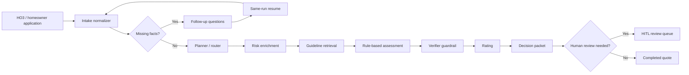

# Agentic Underwriter

A governed agentic workflow that turns a homeowner-insurance application into a
cited `ACCEPT` / `REFER` / `DECLINE` decision, with human-in-the-loop review.

**Portfolio proof points:** CI-gated evals across 196 stratified cases with 100%
decision accuracy, 100% reason-code match, 100% retrieval recall@5, and 30
passing product tests.

This repo demonstrates a compact quote-to-underwrite workflow for homeowners
submissions, including HO3 homeowners policies. It is built to show the product
loop reviewers care about: normalize an intake, identify missing or uncertain
facts, ask targeted follow-up questions, resume the same quote run, produce a
decision packet, and route referrals to a human review queue.

Architecture note: deterministic underwriting rules remain the governed source
of truth for eligibility decisions. AI components assist with retrieval,
evidence grounding, rationale support, follow-up question workflows, and
orchestration around the decisioning layer.

## What It Shows

- FastAPI quote endpoints for legacy quote payloads and canonical HO3 payloads.
- Seven-step deterministic agent workflow orchestration for intake, routing,
  enrichment, retrieval, assessment, verification, rating, and decision
  packaging.
- Missing-info loop for roof age, occupancy, applicant/address gaps, and
  wildfire mitigation evidence.
- Same-run resume through `/runs/{run_id}/answers` with audit events preserved.
- Human review queue for referred or declined risks.
- Decision packets with system recommendation, confidence, reason codes,
  citations, next steps, premium indication, facts used, and a trace reference.
- Versioned deterministic underwriting rules backed by lexical, semantic, or
  hybrid guideline retrieval.
- Structured LLM service boundary for producer-facing rationale and
  missing-info wording, with Pydantic validation and deterministic fallback.
- Streamlit demo for editing submissions, running the workflow, viewing
  citations, and inspecting audit/HITL status.

## Architecture



## Run

```bash
pip install -r requirements.txt
cp .env.example .env
python -m pytest
uvicorn app.main:app --reload
```

The API will be available at `http://localhost:8000`.

## Modal Deployment

Live API docs:
[https://ln-tuttagunta--agentic-underwriter-fastapi-app-dev.modal.run/docs](https://ln-tuttagunta--agentic-underwriter-fastapi-app-dev.modal.run/docs)

List runs endpoint docs:
[https://ln-tuttagunta--agentic-underwriter-fastapi-app-dev.modal.run/docs#/default/list_runs_runs_get](https://ln-tuttagunta--agentic-underwriter-fastapi-app-dev.modal.run/docs#/default/list_runs_runs_get)

Smoke test:

```bash
curl https://ln-tuttagunta--agentic-underwriter-fastapi-app-dev.modal.run/health
```

This repo includes a Modal ASGI entrypoint for the existing FastAPI app:

```bash
modal setup
modal serve modal_app.py
modal deploy modal_app.py
```

`modal_app.py` builds a Python 3.13 image from `requirements.txt`, includes the
local application packages and underwriting guideline documents, mounts a
durable Modal Volume at `/data`, and points SQLite at
`sqlite:////data/underwriting.db`. The deployed endpoint serves the same API
routes as local `uvicorn`; deterministic underwriting rules remain the governed
decision layer. The Modal function is capped at one container because the
portfolio deploy uses SQLite on a Modal Volume; move `DATABASE_URL` to a managed
database before raising container count for higher write concurrency.

Useful Modal knobs:

```bash
MODAL_APP_NAME=agentic-underwriter
MODAL_DATA_VOLUME=agentic-underwriter-data
```

Structured LLM output is disabled by default for deploy parity. Enable it with a
Modal Secret or environment variables only when you want provider-backed wording:

```bash
LLM_STRUCTURED_OUTPUT_ENABLED=true
OPENAI_API_KEY=...
```

## Interactive Demo

Run the Streamlit demo locally:

```bash
pip install -r requirements.txt -r requirements-demo.txt
streamlit run demo_app.py
```

The demo loads sample homeowner submissions, lets you edit the JSON payload,
runs the workflow in-process, and shows the final decision packet, rationale,
reason codes, citations, premium indication, audit events, and follow-up
questions when more information is required.

## One-Command Walkthrough

Run the product walkthrough without starting a separate server:

```bash
python scripts/demo_walkthrough.py
```

The script uses FastAPI's in-process test client to exercise the real API
routes. It walks through a missing roof-age pause and same-run resume, then a
wildfire mitigation follow-up that moves into human review and approval.
The payloads live in `examples/demo_submissions.json` so the walkthrough is
separate from test fixtures.

Compare retrieval modes for a single query:

```bash
python scripts/compare_retrieval.py --query "high wildfire risk roof age referral"
```

The comparison CLI prints lexical, semantic, and hybrid results side by side
with source document, score, chunk ID, and snippet.

Generate and run the labeled workflow eval harness:

```bash
python -m evals.generate_dataset
python -m evals.run --dataset evals/datasets/ho3_labeled.jsonl
```

The eval dataset contains 196 stratified HO3 submissions with expected
decisions, reason codes, workflow statuses, and gold citation chunk IDs. The
runner reports decision accuracy, reason-code exact match, retrieval recall@k,
and optional rationale quality.

Current CI-gated metrics:

| Metric | Value |
| --- | ---: |
| Labeled cases | 196 |
| Strata | 12 |
| Decision accuracy | 100% |
| Reason-code match | 100% |
| Retrieval recall@5 | 100% |
| Product tests | 30 passing |

Coverage breakdown:

| Outcome / status | Cases |
| --- | ---: |
| `ACCEPT` | 38 |
| `REFER` | 127 |
| `DECLINE` | 31 |
| `completed` | 38 |
| `pending_review` | 122 |
| `waiting_for_info` | 36 |

Run the same threshold gate used in CI:

```bash
python -m evals.run \
  --dataset evals/datasets/ho3_labeled.jsonl \
  --json \
  --min-decision-accuracy 1.0 \
  --min-reason-code-match 1.0 \
  --min-retrieval-recall 1.0
```

Exit code `0` means configured thresholds passed, `1` means metric thresholds
failed, and `2` means the dataset or eval run could not be loaded.

## Retrieval Config

Lexical retrieval is the default and fallback. Semantic and hybrid retrieval use
a built-in deterministic hash-embedding provider by default, so the core
workflow can run without network calls or model downloads.

```bash
RAG_RETRIEVAL_MODE=lexical|semantic|hybrid
RAG_EMBEDDINGS_ENABLED=true|false
EMBEDDING_MODEL=hashing-underwriting-v1
```

To experiment with sentence-transformers, install the optional package
and set `EMBEDDING_MODEL=sentence-transformers:all-MiniLM-L6-v2`. If embeddings
are unavailable, semantic and hybrid modes fall back to lexical retrieval.

## Configuration

Copy `.env.example` to `.env` for local configuration. The defaults run the
governed workflow with lexical retrieval, deterministic fallback wording, and
in-process trace recording. Enable semantic retrieval, provider-backed
structured LLM output, or OpenTelemetry export by changing the relevant
environment variables rather than editing workflow code.

## Structured LLM Output

LLM calls are intentionally narrow. Deterministic underwriting rules decide
`ACCEPT`, `REFER`, or `DECLINE`; the LLM service can only assist with
producer-facing rationale wording and missing-info follow-up wording after the
workflow has already identified the decision or the required fields.

```bash
LLM_STRUCTURED_OUTPUT_ENABLED=true|false
LLM_PROVIDER=openai|disabled
LLM_MODEL=gpt-4o-mini
OPENAI_API_KEY=...
LLM_PROMPT_VERSION=structured-llm-v1
```

Set `LLM_STRUCTURED_OUTPUT_ENABLED=true` with an API key to enable provider
calls. The `app/llm_service.py` provider wrapper sends prompt templates from
`app/prompt_templates.py` and validates responses against Pydantic models before
they enter the workflow state or decision packet. If no API key or provider is
available, the same deterministic fallback wording is validated and used.

## Core API Flow

Start a canonical HO3 run:

```bash
curl -X POST http://localhost:8000/quote/ho3 \
  -H "Content-Type: application/json" \
  -d '{
    "submission": {
      "applicant": {"full_name": "Robert Johnson"},
      "risk": {
        "property_address": "789 Pine St, Los Angeles, CA 90001",
        "occupancy": "owner_occupied_primary",
        "dwelling_type": "single_family",
        "year_built": 1995,
        "roof_age_years": null,
        "construction_type": "frame",
        "stories": 1
      },
      "coverage_request": {"coverage_a": 350000, "deductible": 1000}
    }
  }'
```

If required facts are missing, the response returns `status:
"waiting_for_info"` and a `required_questions` list. Each question includes a
`question_id`, `field_path`, `question_text`, `question_type`, and any available
options.

Resume the same run after the agent or underwriter answers:

```bash
curl -X POST http://localhost:8000/runs/{run_id}/answers \
  -H "Content-Type: application/json" \
  -d '{
    "answered_by": "underwriter",
    "answers": {"roof_age_years": 7}
  }'
```

The resumed response keeps the original `run_id`, appends answer events to the
audit trail, and continues through retrieval, assessment, rating, and decision
packaging.

The legacy `/quote/run` endpoint accepts a `QuoteSubmission` wrapped in a
`QuoteRunRequest` body (the `submission` object is required; `use_agentic` and
`additional_answers` are optional):

```bash
curl -X POST http://localhost:8000/quote/run \
  -H "Content-Type: application/json" \
  -d '{
    "submission": {
      "applicant_name": "Robert Johnson",
      "address": "789 Pine St, Los Angeles, CA 90001",
      "property_type": "single_family",
      "coverage_amount": 350000
    },
    "use_agentic": false
  }'
```

## Human Review Flow

Referral and decline outcomes move to `pending_review` and can be listed:

```bash
curl http://localhost:8000/reviews/pending
```

Inspect the review packet:

```bash
curl http://localhost:8000/reviews/{run_id}
```

Approve the AI recommendation, override it, or request more information:

```bash
curl -X POST http://localhost:8000/reviews/{run_id}/actions \
  -H "Content-Type: application/json" \
  -d '{
    "action": "approve",
    "reviewer": "senior_uw",
    "note": "Citations and referral rationale reviewed."
  }'
```

The workflow stores the AI recommendation separately from the human final
decision so the audit trail does not overwrite model output.

## Decision Packet

Completed and referred runs return a `decision` object sourced from the internal
decision packet:

- `decision`: `ACCEPT`, `REFER`, or `DECLINE`
- `confidence`: decision confidence
- `review_reason_codes`: underwriting triggers such as `ROOF_AGE` or
  `WILDFIRE_HIGH`
- `citations`: retrieved guideline snippets used to support referral or decline
- `next_steps`: producer or underwriter actions
- `premium`: transparent premium indication

Use `/runs/{run_id}/audit` for the full workflow state, node outputs, required
questions, answer events, and final completion events.

## Engineering Notes

This repo is organized as a governed agentic workflow around deterministic
underwriting controls.

- **Why seven agents:** the workflow separates intake normalization, routing,
  enrichment, retrieval, underwriting assessment, verification, rating, and
  packaging so each step has a clear contract and can be tested or replaced
  independently. That mirrors the operating model of regulated underwriting:
  facts, evidence, decisioning, and review need distinct accountability.
- **Why deterministic rules first:** underwriting decisions are high-consequence
  and must be repeatable. The system uses deterministic rules and governed
  retrieval so referral reasons, citations, and tests are stable. An LLM can be
  added for question wording, document extraction, query formulation, or
  summarization without becoming the source of truth for eligibility.
- **LLM guardrails:** structured LLM output is constrained to two assistant
  tasks: producer rationale and follow-up wording. Provider responses must pass
  Pydantic validation, cannot alter question identifiers or answer contracts,
  and never set the eligibility outcome.
- **Auditability:** every run has a durable `run_id`; missing-info pauses,
  follow-up answers, review actions, node outputs, decision packets, and final
  outcomes are stored with the run. Human review decisions are recorded
  separately from the system recommendation so the audit trail does not rewrite
  the original decision.
- **Reliability boundaries:** validation and routing happen before strict HO3
  model construction so incomplete submissions can pause cleanly instead of
  failing. Referral and decline decisions require retrieved citations before the
  decision packet is finalized. Persistence is abstracted behind the storage
  layer so SQLite can be replaced by Postgres without changing workflow
  contracts.
- **Reliability and extension points:** hazard enrichment, retrieval,
  traceability, HITL assignment, auth, rate limits, idempotency, and PII
  redaction are intentionally separated behind modules that can be hardened
  independently as the application moves toward production deployment.
- **Production extension path:** replace deterministic enrichment with provider
  integrations, move persistence to Postgres, add idempotency and auth, persist
  OpenTelemetry traces, introduce queue-backed HITL tasks, and add LLM/tool
  calls behind the existing agent contracts for extraction, evidence gathering,
  and producer-facing explanations. Keep deterministic rule evaluation as the
  governed decision layer.

## Roadmap

- Add production-grade embedding providers and LLM-as-judge rationale evals
  alongside the existing deterministic retrieval and workflow metrics.
- Explore constrained LLM tool orchestration for non-binding assistance, while
  keeping deterministic rules as the governed eligibility decision layer.

## Scenario Coverage

The one-command walkthrough uses `examples/demo_submissions.json`. The product
tests also use curated scenarios in `tests/demo_scenarios.py`, including:

- low-risk accepted quote
- high wildfire referral with mitigation-evidence follow-up
- missing roof age waiting for info and same-run resume
- old construction referral
- flood referral
- tenant-occupied referral

## Test Scope

The default pytest suite runs maintained product tests only:

```bash
python -m pytest
```

These tests cover quote contracts, missing-info resume, review queue actions,
explicit rule triggers, lexical and semantic RAG behavior, fallback retrieval,
eval harness behavior, rating sanity checks, and end-to-end underwriting
scenarios.

## Traceability

`observability.py` provides a tracer abstraction with completed span records,
attributes, status, timing, and exporter boundaries. The default `memory`
backend records spans in-process for tests and audit inspection; `logging`
emits structured span records to application logs; `otel` routes spans through
OpenTelemetry when the host environment provides the SDK configuration.
Decision packets include trace references so workflow output can be joined to
span data.

## Production Hardening Roadmap

The next production hardening steps are clear and modular: connect external
hazard, claims, geocoding, and RCE providers; move persistence to Postgres; add
auth, idempotency, rate limits, and PII redaction; persist distributed traces;
and introduce queue-backed HITL assignment with SLA tracking.
